# Vehicle Insurance MLOps Pipeline

## Project Overview
This project productionizes a vehicle insurance risk model by automating every stage of the machine-learning lifecycle. It covers reproducible template generation, secure data ingestion, validated feature engineering, model training, and AWS-backed deployment through Dockerized CI/CD pipelines—all designed to satisfy enterprise standards for observability, security, and scalability.

## Project Flow
- **Step 1 – Project Template**: Run `template.py` to scaffold the repository with logging, configuration, and modular directories.
- **Step 2 – Packaging Enablement**: Configure `setup.py` and `pyproject.toml` so the `src` package installs cleanly in virtual environments and CI runners.
- **Step 3 – Environment Provisioning**: Create the `vehicle` Conda environment (`python=3.10`), install dependencies via `requirements.txt`, and verify packages with `pip list`.
- **Steps 4 – MongoDB Setup**: Provision MongoDB Atlas (M0 cluster), secure credentials, and capture the Python connection string for downstream ingestion.
- **Steps 5 – Logging, Exceptions, Notebooks**: Implement centralized logging/exception modules and notebooks for EDA plus feature engineering.
- **Steps 6 – Data Ingestion**: Define constants, MongoDB connection helpers, data-access utilities, and config/artifact entities to pull raw documents into structured train/test CSVs.
- **Steps 7 – Validation, Transformation, Training**: Author dataset schemas, validation checks, transformation logic (including estimators), and a model trainer component that persists artifacts for reproducibility.
- **Steps 8 – AWS Integration & Evaluation**: Store AWS credentials, declare `MODEL_BUCKET_NAME` and `MODEL_PUSHER_S3_KEY`, implement S3 connectivity, add model evaluation thresholds, and wire the prediction pipeline within `app.py`.
- **Steps 9 – CI/CD & Deployment**: Add static/templates, craft Docker assets and `.dockerignore`, configure GitHub Actions (`aws.yaml`), set up IAM/ECR/EC2, register a self-hosted runner, create GitHub secrets, and expose port 5080 so the containerized app (with `/training` endpoint) ships automatically on every push.

## Architecture Diagram

```mermaid
flowchart LR
    subgraph Data Layer
        A[MongoDB Atlas<br/>Raw Policies]
    end
    subgraph Pipeline
        B[Data Ingestion<br/>constants + data_access]
        C[Data Validation<br/>schema checks]
        D[Data Transformation<br/>feature store + estimators]
        E[Model Trainer<br/>training pipeline]
        F[Model Evaluation<br/>threshold 0.02]
        G[Model Pusher<br/>S3 registry]
    end
    subgraph Delivery
        H[S3 Model Registry<br/>MODEL_PUSHER_S3_KEY]
        I[Docker Image]
        J[GitHub Actions<br/>aws.yaml + self-hosted runner]
        K[AWS ECR]
        L[AWS EC2 / App.py<br/>Port 5080 + /training]
    end

    A --> B --> C --> D --> E --> F --> G
    G --> H
    H --> I
    I --> J --> K --> L
    J -.->|Secrets| H
```

## Techniques and Technologies
- **Modular MLOps Workflow**: Constants, configuration entities, artifact entities, and component classes enforce clean boundaries and testability across stages.
- **MongoDB Atlas**: Managed NoSQL store that scales ingestion of policy data while simplifying schema evolution.
- **AWS (IAM, S3, ECR, EC2)**: Powers secure credential management, artifact storage, container registry, and self-hosted runners for production workloads.
- **GitHub Actions with Self-Hosted Runner**: Provides auditable CI/CD that can access private infrastructure and deploy Docker images on demand.
- **Docker-Based Deployment**: Ensures environment parity from local dev to EC2 releases and simplifies horizontal scaling.
- **Observability Stack**: Structured logging plus exception handling deliver actionable telemetry across notebooks, pipelines, and API routes.

## Achievements
- Established a reproducible, version-controlled ML pipeline—from ingestion through deployment—that minimizes manual intervention.
- Automated container builds and AWS releases, reducing deployment friction to a single git push while maintaining least-privilege credentials.
- Bridged research and production by combining notebooks for rapid experimentation with hardened modules and CI gates for delivery.

## Usage Instructions
1. **Create Environment**: `conda create -n vehicle python=3.10 -y` and `conda activate vehicle`.
2. **Install Dependencies**: `pip install -r requirements.txt` and confirm `src` availability via `pip list`.
3. **Run Pipelines**: Execute the corresponding pipeline scripts (e.g., `python main.py`) to generate artifacts under `artifact/`.
4. **Start Application**: `python app.py` for local serving, or build/run the Docker image for production parity.
5. **Trigger CI/CD**: Push to the default branch to invoke `.github/workflows/aws.yaml`, which builds the container, pushes to ECR, and deploys through the EC2 self-hosted runner exposing port 5080.

## Conclusion
The Vehicle Insurance MLOps Pipeline is an approach to ML system design—pairing disciplined software engineering with scalable cloud operations. Future iterations can extend monitoring, add automated rollback safety nets, and support multi-model routing, but the current foundation is already ready for enterprise deployment and rapid iteration. 